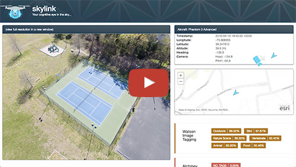
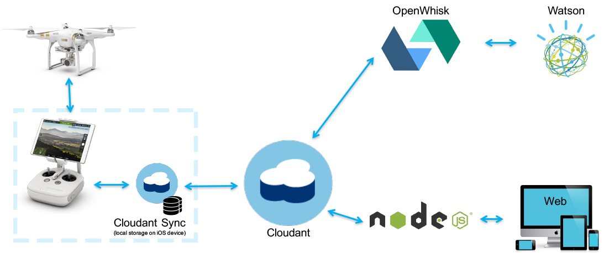
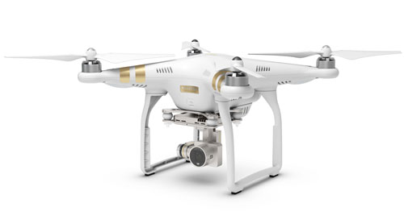
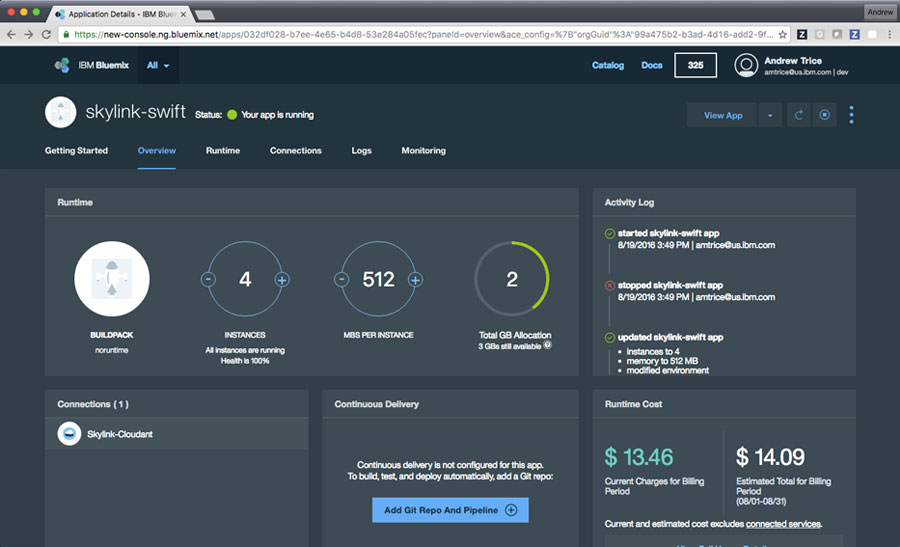
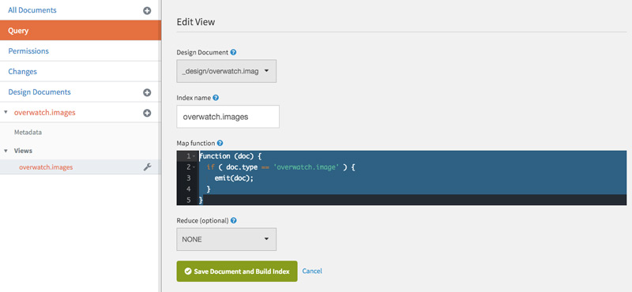
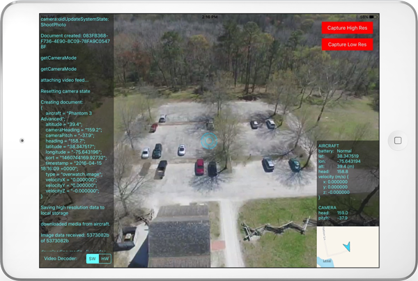
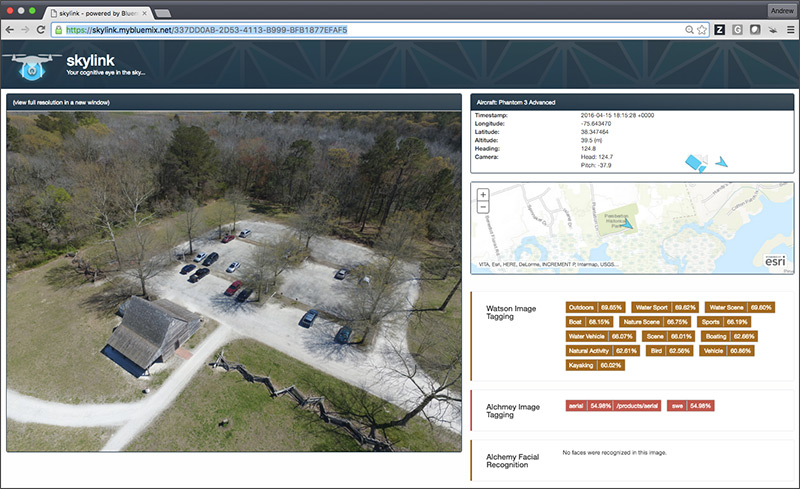

# skylink
Skylink is a sample application that lets you connect a [DJI][dji] drone aircraft to the [IBM Cloud][bluemix] with near realtime image analysis leveraging [IBM Cloudant][cloudant], [OpenWhisk][openwhisk], [IBM Watson][watson_visual_recognition], and [Alchemy Vision][alchemy_vision].  

This is a proof of concept use case that demonstrates how low cost/commodity off-the-shelf consumer drones can be integrated into enterprise workflows immediately, leveraging existing technology and infrastructure.

You can read more about the context and usage of this application in [this blog post on the Bluemix blog][bluemix_dw_blog_post], or by viewing [this free webinar][webinar] that walks through the entire solution.

Check out the video below for a quick overview how the application works.    
 
 [][youtbue_video]

https://youtu.be/BHmo8oWENJo


## General Architecture
The application connects a [DJI][dji] drone aircraft to [IBM Bluemix][bluemix] by using an iPad to bridge the connection from aircraft to the external network & cloud services.  The aircraft remote control connects directly to the controller using a USB connection.  This allows the aircraft to send a live video stream, captured media, and telemtry data directly to an app running on the iPad.  This also allows the iPad to send control instructions to the aircraft, enabling the app to control what the aircraft is doing.  All communication back and forth between the aircraft and app on the iPad is handled using [DJI's developer toolkit][dji_dev]. 



The app captures aircraft telemtry data and images (either full resolution images or video frame grabs) and stores them locally on the iPad using [Cloudant Sync][coudant_sync] - This prevents data loss if you are flying in an area without any network connectivity.  When there is data connectivity, the data is automatically replicated up to the [Cloudant][cloudant] service.  Saving data into Cloudant automatically triggers [OpenWhisk][openwhisk] actions to process the images and data using [Watson Visual Recognition][watson_visual_recognition] and [Alchmey Vision][alchemy_vision] services.  Once all the data has been processed, it is available through a web interface powered by Node.js running on [IBM Bluemix][bluemix]. 

## The Aircraft

All development was done using a [DJI Phantom 3 Advanced][dji_phantom] aircraft, though this should also work with [DJI Inspire][dji_inspire] series aircraft.  This aircraft is relatively low cost (under $1000), is very easy to fly by leveraging GPS assisted & stabilized flight, delivers high quality stabilized HD video and high resolution still images, has a range over 1 mile, flight times over 20 minutes per battery, and is immediately ready to fly "out of the box".



---

## Application Requirements

* IBM Bluemix account. [Sign up][bluemix_signup_url] for Bluemix, or use an existing account.
* IBM Bluemix OpenWhisk early access. [Sign up for Bluemix OpenWhisk](https://new-console.ng.bluemix.net/openwhisk). 
* XCode

*You might notice references to 'overwatch' throughout this project.  That was the original project name, but let's face it, 'overwatch' makes you think of a creepy big-brother concept, so I changed it.  Unfortunately, there are still references to the old name throughout the code.*


# Bluemix Services

Create a new Node.js app on Bluemix, and configure it to use the following services:

* [Cloudant NoSQL Database][cloudant]
* [Alchemy API][alchemy_vision]
* [Watson Visual Recognition][watson_visual_recognition]



# Cloudant Database

Once you've configured your app on Bluemix to use the Cloudant NoSQL database, you'll next need to configure it.

1. First, create a new database called ```overwatch```
2. Next, create a view on the database with the index name ```overwatch.images```, and use the following map function:
``` 
function (doc) {
    if ( doc.type == 'overwatch.image' ) {
      emit(doc);
    }
} 
```



# iOS Client Project 

The iOS application is the bridge from aircraft to the cloud.  The iPad connects directly to the aircraft controller over USB, and can communicate to the cloud using wifi or 3G/4G cellular networks.  It provides a first-person video view, lets you view telemetry data, and has two options for capturing images from the aircraft:

* Capture a full resolution (4000x3000) image using the camera funcionality (slow and requires interruption to live stream)
* Capture a screen grab from the live video stream (720p MAX, low quality) (very fast, but not as high quality)   



The iOS Client project leverages [DJI's developer SDK][dji-sdk] to communicate with the aircraft.  In particular, this app was developed using [version 3.1][dji-sdk-specfic]. 

*Note: It is very important to make sure that the aircraft firmware is in synch and using the same version of the SDK, otherwise aircraft features may not operate as expected.* 

To build the iOS Client, download the source for this project and navigate to the ```client``` folder.  It is required to copy resources from the [DJI SDK][dji-sdk-specfic] before the iOS project will compiler properly.  You will also need to [create an "app" on DJI's portal][dji-apps] before you will be able to communicate with the aircraft.

The following resource need to be copied from the SDK download into the client project before you will be able to compile:

| File | SDK Location | iOS Project Location |
| ---- | ------------ | -------------------- |
| DJIBaseViewController.swift | /Sample Code/SwiftSampleCode/DJISDKSwiftDemo/Missions | /client/skylink/DJI-SDK/DJI-Swift |
| DJISDK.framework | /Sample Code/ | /client/skylink/DJI-SDK |
| Video Previewer.xcodeproj | /Sample Code/VideoPreviewer/ | /client/skylink/DJI-SDK |
| Video Previewer *(directory)* | /Sample Code/VideoPreviewer/ | /client/skylink/DJI-SDK |

For more detail about compiling/building with the DJI SDK, check out [the docs][dji-sdk].

You will need to run the Cocoapods install process to pull down required dependencies: 
```
pod install
```

Important parts of the iOS Client Project:

| File | Details |
| ---- | ------- |
| Overwatch/DataManager.swift | Handles data persistence, writing data to the Cloudant Sync local store, and replication to the Cloudant service. |
| ViewController.swift | Handles general UI interactivity and displaying data from the aircraft SDK |


# OpenWhisk Analysis

*The OpenWhisk actions that are used to process these images are forked from the [Dark Vision](https://github.com/IBM-Bluemix/openwhisk-darkvisionapp) app created by my colleage Frederick Lavigne.  If you have not yet seen this applicaiton, you really should check it out... it's quite impressive.*

All code for the OpenWhisk actions are contained within the ```processing``` directory.

The OpenWhisk actions are automatically triggered by changes to the Cloudant database.  The general flow is:

* Data change invokes analysis actions
* If the data is new &amp; not analyzed, it will follow this sequence:
    * Retrieve the complete document from Cloudant
    * Retrieve the image attachment binary file
    * Generate a thumbnail image
    * Analyze the image (in parallel):
        * Alchemy Facial Recognition
        * Alchemy Image Keywords
        * Watson Visual Recognition
    * Write analysis results back to Cloudant
    * Save the image thumbnail back to Cloudant
    * Generate images for each detected face and save to Cloudant

You must have the [OpenWhisk][openwhisk] CLI already installed.

To install the OpenWhisk actions, first edit the local.env file to contain authentication credentials for your Bluemix services.

Next run the following command to create the trigger for the Cloudant database, and the actions required to complete the image analysis:
```
./skylink.sh --install 
```

There are also methods in the shell script to uninstall or reinstall these actions, if desired.


# Node.js Web Client

You can run the web applicaiton locally, or push it to your Node.js instance(s) on Bluemix.  All code for the Node.js app is contained within the ```web``` directory.



### Running Node.js Locally
To run the application locally, you first need to download dependencies by running:
```
npm install
```

*You only need to do this next step if you are running locally, you do not need to configure credentials if running on Bluemix.* 
Next, add authentication credentials to the ```configuration.json``` file.  You can get these by clicking on the "Show Credentials" link for each service in your app on Bluemix.  In the old Bluemix interface these are on the main app landince screen.  In the new Bluemix interface, these are avilable under the "Connections" tab.  

Launch the app:
```
node app.js
```

### Running Node.js on Bluemix
To run the Node.js application on Bluemix, you only need to push the code to the Bluemix applicaiton instance.
From inside the ```web``` directory, run the following command to push the app up to Bluemix:

```
cf push
```

*This will use the app name configued within ```manifest.yml```*    

# Contribute

Please create a pull request with your desired changes.

# Troubleshooting

## OpenWhisk

Polling activations is good start to debug the OpenWhisk action execution b/c it let's you see console.log() output for most actions. Just run the following command in a terminal window (with the OpenWhisk CLI installed):
```
wsk activation poll
```
When data is saved into Cloduant, the OpenWhisk actions will automatically be invoked, and you will be able to view debug output for the processing steps.

## Web application

Either use the Bluemix web user intefact to view debug logs, or use the Cloud Foundry CLI to look view live logs for the Node.js application running on Bluemix:
```
cf logs <appname>
```


# License

See [License.txt](License.txt) for license information.

# Privacy Notice

The web application includes code to track deployments to [IBM Bluemix](https://www.bluemix.net/) and other Cloud Foundry platforms. The following information is sent to a [Deployment Tracker](https://github.com/cloudant-labs/deployment-tracker) service on each deployment:

* Application Name (`application_name`)
* Space ID (`space_id`)
* Application Version (`application_version`)
* Application URIs (`application_uris`)

This data is collected from the `VCAP_APPLICATION` environment variable in IBM Bluemix and other Cloud Foundry platforms. This data is used by IBM to track metrics around deployments of sample applications to IBM Bluemix to measure the usefulness of our examples, so that we can continuously improve the content we offer to you. Only deployments of sample applications that include code to ping the Deployment Tracker service will be tracked.

## Disabling Deployment Tracking

Deployment tracking can be disabled by removing require("cf-deployment-tracker-client").track(); from the beginning of the web/app.js file.


[dji]: http://www.dji.com/
[dji_phantom]: http://www.dji.com/products/phantom
[dji_inspire]: http://www.dji.com/products/inspire
[dji_dev]: http://developer.dji.com
[dji-sdk]: https://github.com/dji-sdk/Mobile-SDK-iOS
[dji-sdk-specfic]: https://github.com/dji-sdk/Mobile-SDK-iOS/releases/tag/v3.1
[dji-apps]: http://developer.dji.com/user/apps/#all
[bluemix_dw_blog_post]: https://developer.ibm.com/bluemix/
[youtbue_video]: https://youtu.be/BHmo8oWENJo
[webinar]: http://ibm.biz/Bd4nkX
[bluemix]: http://bluemix.net
[bluemix_signup_url]: https://console.ng.bluemix.net/?cm_mmc=GitHubReadMe
[cloudant]: https://cloudant.com/
[openwhisk]: https://developer.ibm.com/openwhisk/
[watson_visual_recognition]: http://www.ibm.com/smarterplanet/us/en/ibmwatson/developercloud/visual-recognition.html
[alchemy_vision]: http://www.alchemyapi.com/products/alchemyvision
[coudant_sync]: https://cloudant.com/cloudant-sync-resources/#.VyLAvZMrJE4

